# Pheromone-based Coverage Path Planning with Greedy Entropy Maximization

*Abstract* — Two promising approaches to coverage path planning are reward-based and pheromone-based methods. Reward-based methods allow heuristics to be learned automatically, often yielding superior performance to hand-crafted rules. On the other hand, pheromone-based methods consistently demonstrate exceptional generalization and adaptation abilities when placed in unfamiliar territory. To obtain the best of both worlds, we introduce Greedy Entropy Maximization (GEM), a hybrid approach that aims to maximize the entropy of pheromone deposited by a swarm of homogenous ant-like agents. We begin by establishing a sharp upper-bound to the achievable entropy and show that this corresponds to generalized optimal coverage path planning. Next, we demonstrate that GEM closely approaches this upper-bound despite depriving agents of basic necessities such as memory and explicit inter-communication. Finally, we show that GEM can be executed asynchronously in constant-time, enabling it to scale arbitrarily. Models and code are available at: [https://github.com/oelin/GEM](https://github.com/oelin/GEM).

## 1. Introduction

Coverage Path Planning (CPP) is the task of directing one or more mobile agents such that they collectively explore the entirety of a given area (1). CPP has numerous applications across domains such as search and rescue, household maintenance, exploration of hazardous environments, and aerial surveillance (2)(3)(4)(5)(6) — to name just a few.

CPP approaches can be categorized along various axes, such as whether they operate in stationary or nonstationary environments (7)(8), or whether they make use of discrete or continuous action-spaces (9)(10). This work concerns two classes of approaches known as *reward-based* and *pheromone-based* respectively. In reward-based approaches, task-specific desiderata are represented by a scalar-valued reward function that is subsequently maximized using reinforcement learning or other mathematical optimization strategies (11). A major advantage to reward-based approaches is that they facilitate the re-use of existing mathematical optimization algorithms, essentially offloading much of the heavy lifting to established techniques. Moreover, through reinforcement learning, they enable effective heuristics to be learned rather than hand-crafted, often leading to superior performance (12)(13)(14).

Orthogonally, pheromone-based approaches take inspiration from natural swarms such ant colonies to encourage successful coverage path planning as the collective behaviour arising from individual interactions (15)(16). Unlike conventional approaches, pheromone-based agents are typically very simplistic and follow policies that rely only on local information. Moreover, these approaches typically feature very weak coupling between agents and their environment, enabling greater generalization to novel settings (17).

While both reward- and pheromone-based approaches have individual merits respectively, few works aim to combine them. We affirm that indeed, the composition of these approaches yields an algorithm that incorporates the benefits of both. Our proposed method, known as Greedy Entropy Maximization (GEM), is based on the observation that maximizing the entropy of pheromone deposited within an environment is equivalent to optimal dynamic coverage path planning. We find that with only local pheromone information, a swarm of homogenous ant-like agents can rapidly increase entropy, leading to remarkably efficient coverage. Most notably, we find that GEM closely approaches the upper-bound on entropy maximization performance, bringing it within proximity to the optimal policy. Our training approach is two-fold. Firstly, we use pretrain GEM policies through imitation learning to approximate the behaviour of an expert hand-crafted policy known as Argmin. This successfully instils strong a prori performance. Secondly, we fine-tune pretrained policies on an entropy maximization objective to learn further refinements. The resulting policies empirically demonstrate strong generalization across diverse environments.

In summary, our contributions are as follows:

1. We introduce entropy maximization as a generalized dynamic coverage path planning objective suitable for learning pheromone-based policies.
2. We propose GEM as a concrete approach that leverages pretraining on expert demonstrations before fine-tuning on an entropy maximization reward.
3. We find that GEM is highly performant and closely approaches the entropy maximization upper-bound. Moreover, our experimental results demonstrate that GEM policies are able to generalize to environment configurations not seen during training.

## 2. Related Work

Prior work has established reward-based and pheromone-based coverage path planning approaches as highly successful. One line of work instigated by Predator-Prey Coverage Path Planning (PPCPP) (Hassan et al., 2020a) (18) introduces a multi-faceted reward function based on the concepts of foraging and risk-of-predation in predator-pray relationships. The reward encourages agents to explore uncovered regions (foraging), while maximizing their distance to a set of virtual predator points. The predators encourage agents to collectively avoid revisiting regions redundantly. Subsequent approaches building on PPCPP include Dec-PPCPP (Hassan et al., 2020b) (19) for decentralized execution and DH-CPP (Zhang et al., 2023) (20), where the method is extended to handle unbounded environments. An alternative line of work is based on incremental expansion of agent regions. For instance, (Liu et al., 2023) (21) train a decentralized multi-agent policy with a reward that strongly penalizes overlap between individual agent regions. Once coverage regions have been established, traditional spanning-tree methods (22) are used to obtain explicit trajectories. The aforementioned works all operate in discrete action-spaces, however reward-based coverage path planning has also been applied to the continuous case. In (Jonarth et al., 2023) (23), an end-to-end reinforcement learning framework is proposed that supports exploration of unknown environments using total variation as a measure of coverage. This approach bares some resemblance to our work in that it constrains agents to egocentric perspectives of their environment. However, our incorporation of pheromone-based signalling additionally enables perpetual (rather than one-time) coverage and adaptation to dynamic obstacles.

Regarding pheromone-based approaches, a seminal work is Stigmergic Coverage (StiCo) (Ranjbar-Sahraei et al., 2012) (24). In this scheme, a team of ant-like agents traverse continuous circular paths that encompass their individual coverage regions. Each agent deposits pheromone along the circumference of its region while also aiming to avoid traversing pheromone deposited by others. Collectively this causes an initially dense packing of agents to disperse and cover the whole area of interest. Following this, BeePCo (Caliskanelli, 2015) (25) take inspiration from the dynamics between queen and worker bees to develop a complementary method to StiCo. Finally, HybaCo (Broecker, 2015) (26) introduces a hybrid ant-and-bee approach, effectively composing aspects of StiCo and BeePCo to compensate for their individual limitations. The authors find that multiplexing between the two approaches in an online fashion, leads to faster and more extensive coverage of the environment.

A key limitation of StiCo is that it does not specify how agents should traverse the interior of their individual coverage regions. While it provides an efficient decomposition of the target area, it does not provide the *explicit coverage trajectories* necessary in many applications (27)(28)(29). We aim to address this limitation in our work.

## 3. Entropy Maximization

In this section, we introduce entropy maximization as a generalized coverage path planning objective and provide a corresponding reward function. The majority of existing reward-based coverage path planning approaches use reward functions that are highly specific and inexorably tied to strong assumptions made by the algorithms in question (30)(31)(32). For instance, in PPCPP, the reward function includes a term that encourages maximizing the distance to virtual predators. However, the pheromone-based approaches of interest to us do not involve such explicit control mechanisms. As such, our reward function must be accordingly generic and decoupled from the policies agents themselves employ. Entropy maximization satisfies this requirement.

Informally, the goal of entropy maximization is to maximize the entropy of pheromone deposited by a swarm of ant-like agents within an environment. Entropy in this case, refers to the Shannon entropy of the normalized pheromone distribution. Since we allow deposited pheromone to decay over time, regions that do not receive frequent updates will cause the pheromone distribution to become more concentrated and take a lower entropy value. Redundant visitation and unnecessary overlap between agent regions also induces a similar effect. Indeed, we find that many conventional coverage path planning desiderata are naturally optimized for when maximizing entropy. To this end, we consider entropy maximization as a satisfactorily general objective that can be used to train pheromone-based policies.

### 3.1. Partially Observable Markov Decision Process

In entropy maximization, we formulate the environment as a Partially Observable Markov Decision Process (POMDP) $(S, A, P_a, R_a)$, where $S$ is the state-space, $A$ is the action-space, $P_a(\mathbf{s}_{t-1} \to \mathbf{s}*t)$ is a dynamics model and $R_a(\mathbf{s}*{t-1} \to \mathbf{s}_t)$ is a reward model. A policy $\pi$ is a deterministic or stochastic function that maps states to actions, i.e. for every state $\mathbf{s}_t \in S$ it produces a corresponding action $a_t \in A$.

Concretely, in expectation maximization each state $\mathbf{s}_t$ holds a distribution of pheromone over the points of a lattice $G = (V, E)$. Each point $v \in V$ represents a location that an agent may exclusively occupy. Each edge $e \in V$ represents a path that an agent may travel along in order to move between points. Hence, the action space for $n$ agents is the set of all $n$-sized subsets of $E$. Under this formulation, obstacles and prohibited actions can be implemented by removing subsets of edges in $E$.

While we assume $P_a$ is unknown due to partial observability, we explicitly define the reward model $R_a$ as follows. Firstly, whenever an agent moves, we assume that it deposits one unit of pheromone to the point it previously occupied. Then, representing the pheromone distribution as a vector, we have that

$$
\begin{align}
\mathbf{s}*t = (1-\alpha)\mathbf{s}*{t - 1} + \mathbf{o}_{t-1},
\end{align}
$$

where $\alpha$ is the *pheromone decay rate* and $\mathbf{o}_{t-1}$ is a one-hot vector containing 1s at the indices of previously occupied points. For brevity, we denote the *normalized* pheromone distribution by

$$ \begin{align} \mathbf{u}_t = \dfrac{\mathbf{s}_t - \min \mathbf{s}_t}{\max \mathbf{s}_t - \min \mathbf{s}_t}. \end{align} $$

Under this formulation, we define the entropy maximization reward as follows:

$$ \begin{align} R_a(\mathbf{s}_{t-1} \to \mathbf{s}_t) = \mathbb{H}[\mathbf{u}*t] - \mathbb{H}[\mathbf{u}*{t-1}], \end{align} $$

where $\mathbb{H}[\cdot]$ is the Shannon entropy measured in nats. Intuitively, this is the difference in entropy between successive time steps. The reward is positive if entropy increases and negative otherwise. Accordingly, the entropy maximization objective can be formulated as the expected cumulative reward obtained by rolling out a given policy $\pi$. This is given by,

$$ \begin{align} U(\pi) = \mathbb{E}\left[\sum_{t=1}^T \gamma^t R_{\pi(\mathbf{s}*{t-1})}(\mathbf{s}*{t-1} \to \mathbf{s}_t)\right], \end{align} $$

where $\gamma$ is the discount rate.

### 3.2. Upper Bound on Coverage Path Planning Performance

An advantage to formulating coverage path planning in terms of entropy maximization is that it enables us to derive a sharp upper bound on coverage path planning performance. With such a bound, we can make quantitative statements about the extent to which candidate policies are optimal.

According to our reward model, the reward accrued at each time step is the change in entropy of the pheromone distribution. We show that this reward is sharply upper bounded by the number of participating agents.

> Theorem 3.2.1. Coverage Path Planning performance is sharply upper bounded by the number of participating agents.
> 
> 
> Let $\pi$ be a policy with $n \ge 1$ participating agents. Then, the expected cumulative reward at time $t$ is *at most*  $\log(nt)$.
> 

Intuitively, a reward of $\log(nt)$ is obtained if, at every time step including $t$, the policy uses $n$ visit $n$ *fresh points*  while maintaining a perfectly uniform distribution over all visited points. The extent to which any policy can achieve this reward depends on the pheromone decay rate $\alpha$. For low decay rates, any policy avoids overlapping paths for $t$ steps will achieve an expected cumulative reward of approximately $\log(nt)$. However, for high decay rates, even a policy that avoids overlaps may struggle to maintain such a high entropy. In this sense, the decay rate hyperparameter regulates the relative difficulty of the CPP task. In our experiments we consider decay rates of $\alpha = 0.01$ (standard) and $\alpha = 0.1$ (hard). Ideally, we would like to find an upper bound that's sensitive to decay rate, however this is highly nontrivial since the pheromone distribution at time $t$ depends on the particular sequence of actions taken in prior states. Nonetheless, the present upper bound is sufficient to make quantitative claims about the optimality of candidate policies.

To justify our use of this upper bound we now offer a formal proof of theorem (3.2.1).

> Let $\pi$ be a policy with $n \ge 1$ participating agents. Let $G = (V, E)$ be the environment lattice. Let $O_t \in V$ denote the subset of points that have ever  been visited at time $t$.
> 
> 
> Since the pheromone distribution is fixed over unvisited points, the entropy at time $t$ is only variant to the pheromone distribution over visited points. The maximum entropy distribution is a uniform distribution over $O_t$. Then,
> 
> $$
> \begin{align}
> \mathbb{H}[\mathbf{u}_t] \le \log |O_t|.
> \end{align}
> $$
> 
> With $n$ agents, the maximum number of visited points at time $t$ is $nt$. Then,
> 
> $$
> \begin{align}
> \mathbb{H}[\mathbf{u}_t] \le \log (nt).
> \end{align}
> $$
> 
> The maximum possible reward at time $t$ occurs when the entropy jumps from zero to $\max \mathbb{H}[\mathbf{u}_t]$. Therefore, it's sharply upper bounded by $\log(nt)$.
> 

## 4. GEM

Greedy Entropy Maximization (GEM) is a hybrid reward- and pheromone-based method for coverage path planning. Concretely, GEM aims to learn a decentralized policy that determines agent actions based only on their immediate surroundings. In our experiments, each agent's local field of view (FOV) encompasses the four points adjacent to its own position, including the pheromone levels residing at said points. This minimal context is passed to a policy function $\pi(\cdot; \theta)$, that returns a distribution over the agent's next action. A complete coverage path plan can then be simulated by rolling-out $\pi(\cdot; \theta)$. Crucially, this scheme yields *constant*  time and space complexity when executed asynchronously (i.e. by each agent in parallel). In practice, the policy can be parameterized by a lightweight multilayer perceptron (MLP), enabling deployment on resource-constrained devices.

We train the policy using multi-agent reinforcement learning through Proximal Policy Optimization (PPO) (33). We found PPO to be substantially more effective in training GEM policies than other methods such as deep Q-learning.

Asynchronous execution implies that agents must act *simultaneously* , i.e. without waiting for each other. In practice, this presents numerous challenges such as the possibility of unacceptable collisions or invalid states (i.e. an agent occupying the same point as a dynamic obstacle). To avoid such circumstances, we combine the entropy maximization reward with an *collision avoidance* term that harshly penalizes actions leading to collisions. Our, complete reward function is given by

$$
\begin{align}
R_a(\mathbf{s}*{t-1}\to\mathbf{s}t) = R\text{EM}(\mathbf{s}*{t-1} \to \mathbf{s}*t) + \beta R*\text{CA}(\mathbf{s}_{t-1} \to \mathbf{s}_t),
\end{align}
$$

where $R_\text{CA}(\cdot)$ returns a value of $-1$ on colliding actions and $0$ otherwise. The hyperparameter $\beta$ controls the degree of penalization. We set this to a high value (i.e. 100) in order to strongly discourage collisions.

### 4.1. Argmin Pretraining

Our most successful GEM policies were trained by first learning to imitate an expert hand-crafted policy known as Argmin. In this policy, each agent choses to move to whichever adjacent point has the least pheromone deposited on it. Unlike GEM, Argmin is synchronous, so implicitly assumes some degree of coordination between agents. Nonetheless, we find that training GEM policies to imitate Argmin, in conjunction with collision avoidance, leads to a faithful asynchronous mimic without the need for inter-agent communication.

After argmin pretraining, we further fine-tune GEM policies on the aforementioned entropy maximization reward. While Argmin is highly effective in early stages of coverage, it often becomes unstable in late stages. Fine-tuning learns adjustments to behaviour that compensate for such failure modes. Fine-tuning may also be used to optimize GEM for specialized enviornments.

## 5. Results

In this section, we present results that empirically validate GEM's performance in various simulated environments. Our methodology revolves around varying key factors such as obstacle density, obstacle stochasticity, number of agents and map size, while measuring how performance varies in response. While we trained GEM on 16x16 maps with only four agents, we find that it generalizes well to novel circumstances.

### 5.1. Metrics

To distil performance into a single scalar value, we measure the discrepancy between the entropy upper-bound and the empirical entropy achieved by GEM throughout the duration of a coverage path plan. Since entropy is logarithmic, we in practice compute the mean difference in perplexity (the P-score) given by

$$
\mathcal{P} = 1 - \cfrac{1}{T} \sum_{t=1}^T \left(\cfrac{\exp(R_t^*)-\exp(R_t)}{\exp(R_t^*)}\right),
$$

where $R_t^*$ denotes the reward obtained by an optimal policy at time $t$. This is just the entropy upper-bound $\mathbb{H}[nt]$.  An optimal policy achieves a P-score of 100% since at all times, it matches the upper-bound perplexity, leading the summation to take on a value of zero.

Aside from $\mathcal{P}$, we use the following notation for other variables of interest:

- $D \in [0, 1)$ - the obstacle density, i.e. the probability that a randomly selected point in the environment lattice is occupied by an obstacle.
- $S \in [0, 1)$ - the obstacle stochasticity, i.e. the probability that a particular obstacle will move at time $t$. In our experiments, we endow obstacles with Brownian motion.
- $n \in \mathbb{N}$ - the number of agents participating in coverage.
- $A \in \mathbb{N}$ - the size of the map (e.g. 16 for a 16x16 map).

In our plots, we render the upper-bound (green dotted), the cumulative GEM reward (blue solid), and the GEM* reward (orange dashed). The latter is the reward GEM would achieve if the pheromone over visited cells was distributed uniformly. Hence, a small distance between GEM and GEM* implies highly uniform pheromone. Conversely, a small distance between GEM* and the upper-bound implies very efficient coverage. If GEM itself is close to the upper-bound, then it must have efficient and uniform coverage. We find this to be the case in numerous environments.

### 5.2. Obstacle Density

How does an GEM policy trained with in low obstacle density environments generalize to higher obstacle density settings? We find that polices trained *without any*  obstacles can nonetheless achieve high coverage in their presence. This holds for densities between 5% and 20%. At obstacle densities high than 20%, a substantial proportion of points are entirely inaccessible and walled off, in which case no policy can cover them. Moreover, many agents spawn in traps, leading to reduced coverage capacity. Under such circumstances, GEM performs poorly, however regains high coverage once the extreme conditions subside.

In the following plots, $\alpha = 0.01, A = 16, n = 16, S = 0$.

Low obstacle density: $D = 0.05$.
Performance: $\mathcal{P} = 0.88$.

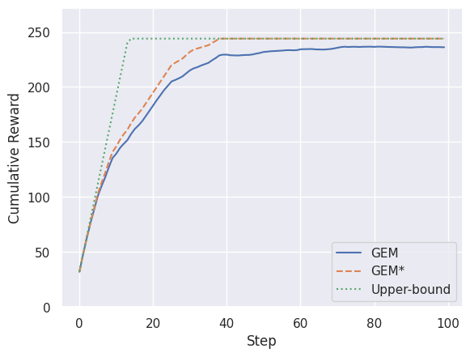

Medium obstacle density: $D = 0.10$.
Performance: $\mathcal{P} = 0.84$.

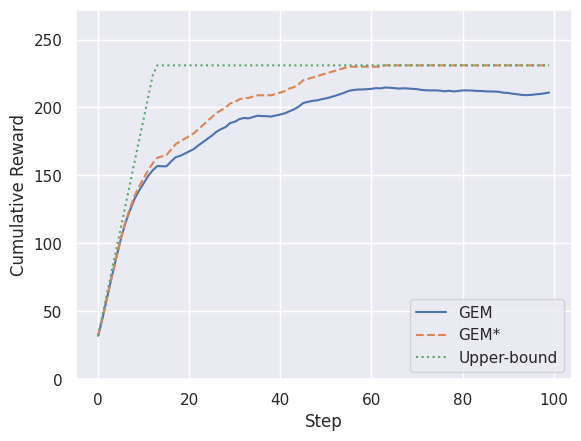

High obstacle density: $0.20$.
Performance: $\mathcal{P} = 0.87$.

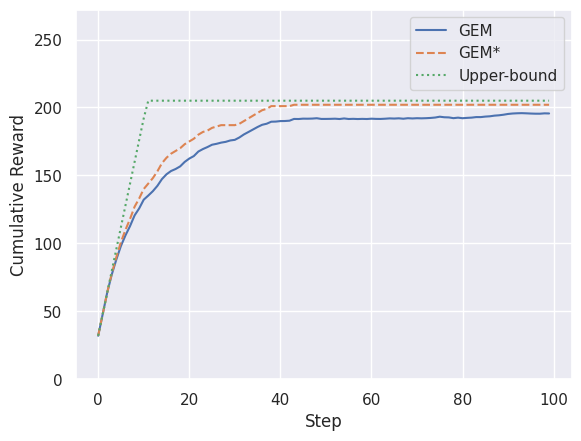

Extreme obstacle density: $0.50$.
Performance: $\mathcal{P} = 0.23$.

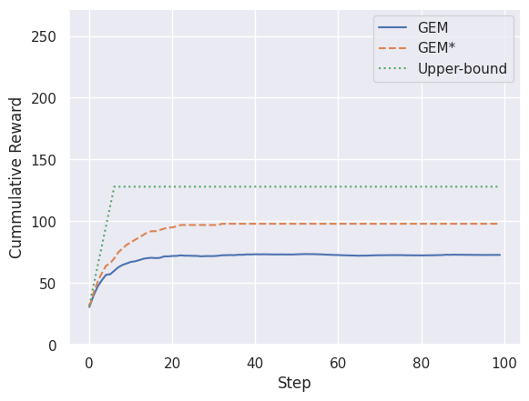

### 5.3. Obstacle Stochasticity

Obstacle stochasticity represents the extent to which obstacles move within the environment. In our experiments, we each obstacle's dynamics is simulated through Brownian motion. Future work may consider more sophisticated dynamics models. We find that increasing stochasticity does not substantially degrade coverage performance in high obstacle density environments. Moreover, in extreme obstacle density environments, increased stochasticity reduces the risk of long-term entrapment or inaccessible points. This appears to have a beneficial effect on coverage performance.

In the following plots, $\alpha = 0.01, A = 16, n = 16, D = 0.2$.

Low obstacle stochasticity: $0.05$.
Performance: $\mathcal{P} = 0.84$.

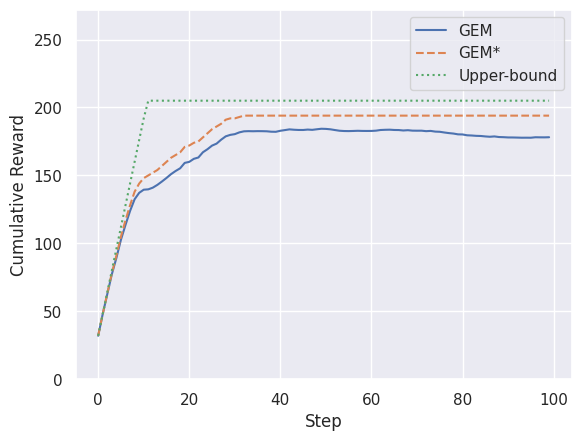

High obstacle stochasticity: $0.20$.
Performance: $\mathcal{P} = 0.81$.

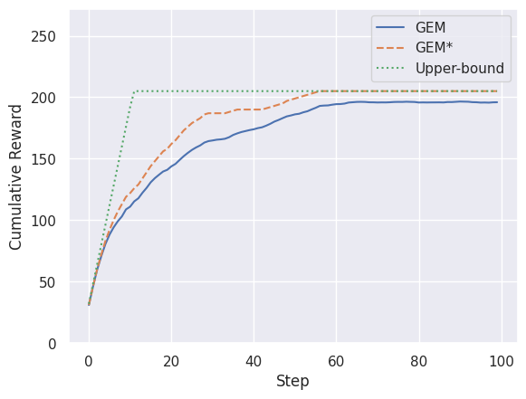

### 5.4. Map Size

As discussed, we trained GEM on 16x16 maps. We find that on larger maps, GEM remains performant given sufficiently many agents. Specifically, we find that approximately $A$ agents are sufficient, where $A$ is the map size. When working with lack of agents, we find that lower pheromone decay rates are beneficial. We attribute this to the reduced risk of premature localization by agents to sub-areas of the map.

In the following plots, $\alpha = 0.01, n = A, D = 0.05, S =0$.

Map size: $A = 16$.
Performance: $\mathcal{P} = 0.85$.

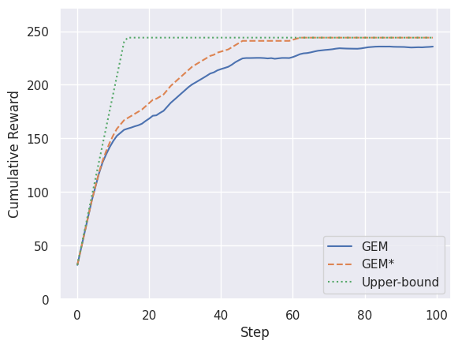

Map size: $A = 32$.
Performance: $\mathcal{P} = 0.81$.

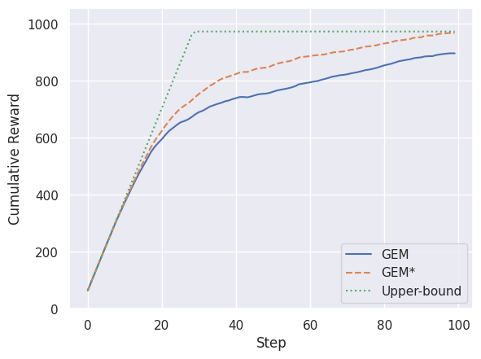

Map size: $A = 64$.
Performance: $\mathcal{P} = 0.79$.

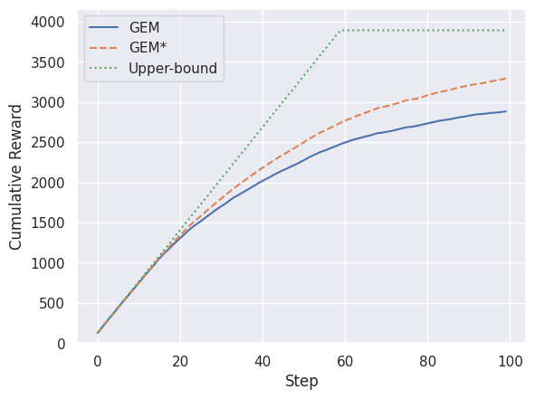

### 5.5. Number of Agents

Increasing the number of agents generally increases coverage *up to a point* . We observe adverse affects in cases with a surplus of agents. Too many agents can occasionally cause high pheromone density zones, where agents struggle to avoid each other. This issue is circumvented by choosing a reasonable number of agents such as $A$.

In the following plots, $\alpha = 0.01, A = 16, D = 0.05, S = 0$.

Low agent count: $n = 4$.
Performance: $\mathcal{P} = 0.81$.

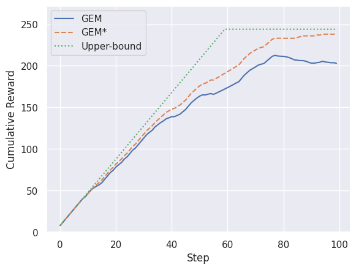

Medium agent count: $n = A$.
Performance: $\mathcal{P} = 0.84$.

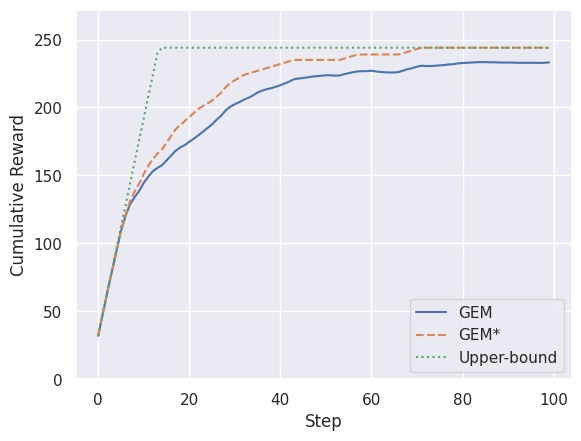

Surplus agent count: $n = 2A$.
Performance: $\mathcal{P} = 0.74$.

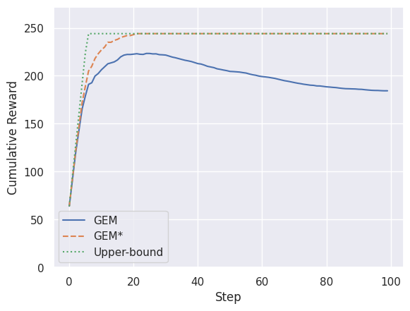

### 5.6. Summary

Our experimental results demonstrate that GEM is highly performant in diverse environments, and often closely approaches the entropy upper-bound. Moreover, GEM polices show signs of strong generalization as they remain performant in conditions not seen during training. We attribute this to the localized nature of decisions made by each agent. We also find certain scenarios in which GEM fails to achieve high coverage. Very high obstacle density environments can slow down coverage substantially due to a lack of long-term path planning. A surplus of agents can also cause agents to cluster in a way that hurts performance. The latter can be circumvented by choosing an appropriate number of agents, however the former problem requires further investigation.

## 6. Conclusion

In this work, we introduce GEM, a novel hybrid reward- and pheromone-based approach to coverage path planning that incorporates the advantages of both approaches. We establish an upper-bound on entropy maximization performance and find empirically that GEM closely approaches it in diverse environments. Moreover, GEM policies trained on simple 16x16 maps without obstacles show signs of strong generalization to novel scenarios. GEM represents the first in a family of hybrid pheromone-based approaches that we intend to peruse in future. In particular, we are interested in the equipping GEM policies with asynchronous inter-communication through self-attention to address the lack of long-term planning in very high density environments.

---

## References

```
@ARTICLE{9523743,
  author={Tan, Chee Sheng and Mohd-Mokhtar, Rosmiwati and Arshad, Mohd Rizal},
  journal={IEEE Access},
  title={A Comprehensive Review of Coverage Path Planning in Robotics Using Classical and Heuristic Algorithms},
  year={2021},
  volume={9},
  number={},
  pages={119310-119342},
  keywords={Robots;Robot sensing systems;Collision avoidance;Robot kinematics;Planning;Three-dimensional displays;Task analysis;Coverage path planning;exploration;heuristic algorithm;deep reinforcement learning},
  doi={10.1109/ACCESS.2021.3108177}}

@article{cho2021coverage,
  title={Coverage path planning for multiple unmanned aerial vehicles in maritime search and rescue operations},
  author={Cho, Sung Won and Park, Hyun Ji and Lee, Hanseob and Shim, David Hyunchul and Kim, Sun-Young},
  journal={Computers \\& Industrial Engineering},
  volume={161},
  pages={107612},
  year={2021},
  publisher={Elsevier}
}

@article{KRISHNALAKSHMANAN2020103078,
title = {Complete coverage path planning using reinforcement learning for Tetromino based cleaning and maintenance robot},
journal = {Automation in Construction},
volume = {112},
pages = {103078},
year = {2020},
issn = {0926-5805},
doi = {<https://doi.org/10.1016/j.autcon.2020.103078>},
url = {<https://www.sciencedirect.com/science/article/pii/S0926580519305813>},
author = {Anirudh {Krishna Lakshmanan} and Rajesh {Elara Mohan} and Balakrishnan Ramalingam and Anh {Vu Le} and Prabahar Veerajagadeshwar and Kamlesh Tiwari and Muhammad Ilyas},
keywords = {Tiling robotics, Cleaning and maintenance, Inspection, Path planing, Reinforcement learning},
abstract = {Tiling robotics have been deployed in autonomous complete area coverage tasks such as floor cleaning, building inspection, and maintenance, surface painting. One class of tiling robotics, polyomino-based reconfigurable robots, overcome the limitation of fixed-form robots in achieving high-efficiency area coverage by adopting different morphologies to suit the needs of the current environment. Since the reconfigurable actions of these robots are produced by real-time intelligent decisions during operations, an optimal path planning algorithm is paramount to maximize the area coverage while minimizing the energy consumed by these robots. This paper proposes a complete coverage path planning (CCPP) model trained using deep blackreinforcement learning (RL) for the tetromino based reconfigurable robot platform called hTetro to simultaneously generate the optimal set of shapes for any pretrained arbitrary environment shape with a trajectory that has the least overall cost. To this end, a Convolutional Neural Network (CNN) with Long Short Term Memory (LSTM) layers is trained using Actor Critic Experience Replay (ACER) reinforcement learning algorithm. The results are compared with existing approaches which are based on the traditional tiling theory model, including zigzag, spiral, and greedy search schemes. The model is also compared with the Travelling salesman problem (TSP) based Genetic Algorithm (GA) and Ant Colony Optimization (ACO) schemes. The proposed scheme generates a path with lower cost while also requiring lesser time to generate it. The model is also highly robust and can generate a path in any pretrained arbitrary environments.}
}

@inproceedings{henshall2024generalized,
  title={Generalized Multiagent Reinforcement Learning for Coverage Path Planning in Unknown, Dynamic, and Hazardous Environments},
  author={Henshall, Andrea and Karaman, Sertac},
  booktitle={AIAA SCITECH 2024 Forum},
  pages={2762},
  year={2024}
}

@article{chen2021clustering,
  title={A clustering-based coverage path planning method for autonomous heterogeneous UAVs},
  author={Chen, Jinchao and Du, Chenglie and Zhang, Ying and Han, Pengcheng and Wei, Wei},
  journal={IEEE Transactions on Intelligent Transportation Systems},
  volume={23},
  number={12},
  pages={25546--25556},
  year={2021},
  publisher={IEEE}
}

@article{chen2022coverage,
  title={Coverage path planning of heterogeneous unmanned aerial vehicles based on ant colony system},
  author={Chen, Jinchao and Ling, Fuyuan and Zhang, Ying and You, Tao and Liu, Yifan and Du, Xiaoyan},
  journal={Swarm and Evolutionary Computation},
  volume={69},
  pages={101005},
  year={2022},
  publisher={Elsevier}
}

@inproceedings{sadek2021dynamic,
  title={A Dynamic Cooperative Multi-Agent Online Coverage Path Planning Algorithm},
  author={Sadek, Mina G and El-Garhy, Ahmed M and Mohamed, Amr E},
  booktitle={2021 16th International Conference on Computer Engineering and Systems (ICCES)},
  pages={1--9},
  year={2021},
  organization={IEEE}
}

@inproceedings{khanam2021offline,
  title={An offline-online strategy for goal-oriented coverage path planning using a priori information},
  author={Khanam, Zeba and Saha, Sangeet and Ognibene, Dimitri and McDonald-Maier, Klaus and Ehsan, Shoaib},
  booktitle={2021 14th IEEE International Conference on Industry Applications (INDUSCON)},
  pages={874--881},
  year={2021},
  organization={IEEE}
}

@article{pour2023complete,
  title={Complete coverage path planning for wheeled agricultural robots},
  author={Pour Arab, Danial and Spisser, Matthias and Essert, Caroline},
  journal={Journal of Field Robotics},
  volume={40},
  number={6},
  pages={1460--1503},
  year={2023},
  publisher={Wiley Online Library}
}

@inproceedings{tang2021mstc,
  title={MSTC∗: Multi-robot Coverage Path Planning under Physical Constrain},
  author={Tang, Jingtao and Sun, Chun and Zhang, Xinyu},
  booktitle={2021 IEEE International Conference on Robotics and Automation (ICRA)},
  pages={2518--2524},
  year={2021},
  organization={IEEE}
}

@inproceedings{shivgan2020energy,
  title={Energy-efficient drone coverage path planning using genetic algorithm},
  author={Shivgan, Rutuja and Dong, Ziqian},
  booktitle={2020 IEEE 21st International Conference on High Performance Switching and Routing (HPSR)},
  pages={1--6},
  year={2020},
  organization={IEEE}
}

@article{ai2021coverage,
  title={Coverage path planning for maritime search and rescue using reinforcement learning},
  author={Ai, Bo and Jia, Maoxin and Xu, Hanwen and Xu, Jiangling and Wen, Zhen and Li, Benshuai and Zhang, Dan},
  journal={Ocean Engineering},
  volume={241},
  pages={110098},
  year={2021},
  publisher={Elsevier}
}

@article{xing2023algorithm,
  title={An Algorithm of Complete Coverage Path Planning for Unmanned Surface Vehicle Based on Reinforcement Learning},
  author={Xing, Bowen and Wang, Xiao and Yang, Liu and Liu, Zhenchong and Wu, Qingyun},
  journal={Journal of Marine Science and Engineering},
  volume={11},
  number={3},
  pages={645},
  year={2023},
  publisher={MDPI}
}

@misc{boufous2020deep,
  title={Deep Reinforcement Learning for Complete Coverage Path Planning in Unknown Environments},
  author={Boufous, Omar},
  year={2020}
}

@article{cheng2024trace,
  title={Trace Pheromone-Based Energy-Efficient UAV Dynamic Coverage Using Deep Reinforcement Learning},
  author={Cheng, Xu and Jiang, Rong and Sang, Hongrui and Li, Gang and He, Bin},
  journal={IEEE Transactions on Cognitive Communications and Networking},
  year={2024},
  publisher={IEEE}
}

@article{tran2023dynamic,
  title={Dynamic frontier-led swarming: Multi-robot repeated coverage in dynamic environments},
  author={Tran, Vu Phi and Garratt, Matthew A and Kasmarik, Kathryn and Anavatti, Sreenatha G},
  journal={IEEE/CAA Journal of Automatica Sinica},
  volume={10},
  number={3},
  pages={646--661},
  year={2023},
  publisher={IEEE}
}

@ARTICLE{8894171,
  author={Hassan, Mahdi and Liu, Dikai},
  journal={IEEE Transactions on Robotics},
  title={PPCPP: A Predator–Prey-Based Approach to Adaptive Coverage Path Planning},
  year={2020},
  volume={36},
  number={1},
  pages={284-301},
  keywords={Service robots;Task analysis;Planning;Surface cleaning;Biological neural networks;Path planning;Adaptive coverage path planning (CPP);complete coverage;dynamic obstacles;three-dimensional (3-D) coverage of complex surfaces},
  doi={10.1109/TRO.2019.2946891}}

@inproceedings{hassan2020dec,
  title={Dec-PPCPP: A decentralized predator--prey-based approach to adaptive coverage path planning amid moving obstacles},
  author={Hassan, Mahdi and Mustafic, Daut and Liu, Dikai},
  booktitle={2020 IEEE/RSJ International Conference on Intelligent Robots and Systems (IROS)},
  pages={11732--11739},
  year={2020},
  organization={IEEE}
}

@article{zhang2023herd,
  title={A Herd-Foraging-Based Approach to Adaptive Coverage Path Planning in Dual Environments},
  author={Zhang, Junqi and Zu, Peng and Liu, Kun and Zhou, MengChu},
  journal={IEEE Transactions on Cybernetics},
  year={2023},
  publisher={IEEE}
}

@misc{liu2022decentralized,
      title={Decentralized Coverage Path Planning with Reinforcement Learning and Dual Guidance},
      author={Yongkai Liu and Jiawei Hu and Wei Dong},
      year={2022},
      eprint={2210.07514},
      archivePrefix={arXiv},
      primaryClass={cs.RO}
}

@article{lu2022tmstc,
  title={TMSTC*: A Turn-minimizing Algorithm For Multi-robot Coverage Path Planning},
  author={Lu, Junjie and Zeng, Bi and Tang, Jingtao and Lam, Tin Lun},
  journal={arXiv preprint arXiv:2212.02231},
  year={2022}
}

@misc{jonnarth2023learning,
      title={Learning Coverage Paths in Unknown Environments with Reinforcement Learning},
      author={Arvi Jonnarth and Jie Zhao and Michael Felsberg},
      year={2023},
      eprint={2306.16978},
      archivePrefix={arXiv},
      primaryClass={cs.RO}
}

@inproceedings{Sahraei2012AMC,
  title={A Multi-robot Coverage Approach Based on Stigmergic Communication},
  author={Bijan Ranjbar Sahraei and Gerhard Weiss and Ali Nakisaee},
  booktitle={Multiagent System Technologies},
  year={2012},
  url={<https://api.semanticscholar.org/CorpusID:6663914>}
}

@InProceedings{10.1007/978-3-319-18084-7_10,
author="Caliskanelli, Ipek
and Broecker, Bastian
and Tuyls, Karl",
editor="Headleand, Christopher J.
and Teahan, William J.
and Ap Cenydd, Llyr",
title="Multi-Robot Coverage: A Bee Pheromone Signalling Approach",
booktitle="Artificial Life and Intelligent Agents",
year="2015",
publisher="Springer International Publishing",
address="Cham",
pages="124--140",
abstract="In this paper we propose BeePCo, a multi-robot coverage approach based on honey bee colony behaviour. Specifically, we propose a honey bee inspired pheromone signalling method that allows a team of robots to maximise the total area covered in an environment in a distributed manner. The effectiveness of the proposed algorithm is experimentally evaluated on three different sizes of multi robot systems (MRSs) and compared against an ant-inspired coverage algorithm (StiCo) to show the different characteristics of these two approaches.",
isbn="978-3-319-18084-7"
}

@InProceedings{10.1007/978-3-319-22416-9_8,
author="Broecker, Bastian
and Caliskanelli, Ipek
and Tuyls, Karl
and Sklar, Elizabeth I.
and Hennes, Daniel",
editor="Dixon, Clare
and Tuyls, Karl",
title="Hybrid Insect-Inspired Multi-Robot Coverage in Complex Environments",
booktitle="Towards Autonomous Robotic Systems",
year="2015",
publisher="Springer International Publishing",
address="Cham",
pages="56--68",
abstract="Coordination is one of the most challenging research issues in distributed multi-robot systems (MRS), aiming to improve performance, energy consumption, robustness and reliability of a robotic system in accomplishing complex tasks. Social insect-inspired coordination techniques achieve these goals by applying simple but effective heuristics from which elegant solutions emerge. In our previous research, we demonstrated the effectiveness of a hybrid ant-and-bee inspired approach, HybaCo, designed to provide coordinated multi-robot solutions to area coverage problems in simple environments. In this paper, we extend this work and illustrate the effectiveness of our hybrid ant-and-bee inspired approach (HybaCo) in complex environments with static obstacles. We evaluate both the ant-inspired (StiCo) and bee-inspired (BeePCo) approaches separately, and then compare them according to a number of performance criteria using a high-level simulator. Experimental results indicate that HybaCo improves the area coverage uniformly in complex environments as well as simple environments.",
isbn="978-3-319-22416-9"
}

@article{huang2020multi,
  title={A multi-robot coverage path planning algorithm for the environment with multiple land cover types},
  author={Huang, Xiang and Sun, Min and Zhou, Hang and Liu, Shuai},
  journal={IEEE Access},
  volume={8},
  pages={198101--198117},
  year={2020},
  publisher={IEEE}
}

@article{munoz2021multi,
  title={Multi UAV coverage path planning in urban environments},
  author={Mu{\\~n}oz, Javier and L{\\'o}pez, Blanca and Quevedo, Fernando and Monje, Concepci{\\'o}n A and Garrido, Santiago and Moreno, Luis E},
  journal={Sensors},
  volume={21},
  number={21},
  pages={7365},
  year={2021},
  publisher={MDPI}
}

@article{xiao2021simulated,
  title={A simulated annealing algorithm and grid map-based UAV coverage path planning method for 3D reconstruction},
  author={Xiao, Sichen and Tan, Xiaojun and Wang, Jinping},
  journal={Electronics},
  volume={10},
  number={7},
  pages={853},
  year={2021},
  publisher={MDPI}
}

@inproceedings{theile2020uav,
  title={UAV coverage path planning under varying power constraints using deep reinforcement learning},
  author={Theile, Mirco and Bayerlein, Harald and Nai, Richard and Gesbert, David and Caccamo, Marco},
  booktitle={2020 IEEE/RSJ International Conference on Intelligent Robots and Systems (IROS)},
  pages={1444--1449},
  year={2020},
  organization={IEEE}
}

@article{yan2020towards,
  title={Towards real-time path planning through deep reinforcement learning for a UAV in dynamic environments},
  author={Yan, Chao and Xiang, Xiaojia and Wang, Chang},
  journal={Journal of Intelligent \\& Robotic Systems},
  volume={98},
  pages={297--309},
  year={2020},
  publisher={Springer}
}

@article{han2020ant,
  title={Ant-colony-based complete-coverage path-planning algorithm for underwater gliders in ocean areas with thermoclines},
  author={Han, Guangjie and Zhou, Zeren and Zhang, Tongwei and Wang, Hao and Liu, Li and Peng, Yan and Guizani, Mohsen},
  journal={IEEE Transactions on Vehicular Technology},
  volume={69},
  number={8},
  pages={8959--8971},
  year={2020},
  publisher={IEEE}
}

```
